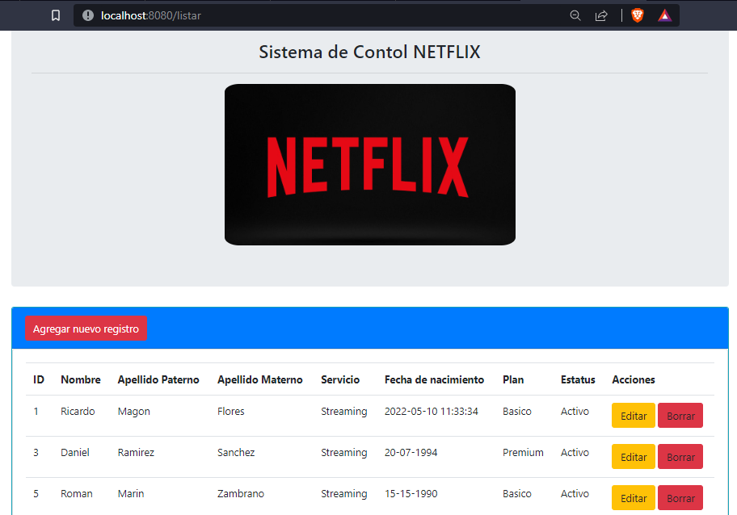

# Streaming-spring

#### Universidad Autónoma de la Ciudad de México

#### Ingenieria en software

#### Nombre: Daniel Ramírez Sánchez

#### Materia: Construccion y evolucion de software

- Practicas de la materia Construccion y Evolucion de Software
  - Practica 4: Aplicación tipo CRUD Web con Maven.

Software: IntelliJ 2022.1, Java 8, Project Maven, Spring Boot 2.7.0
